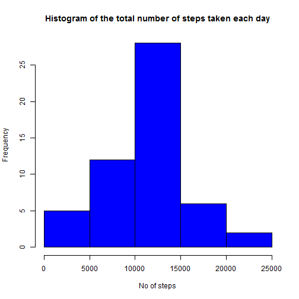
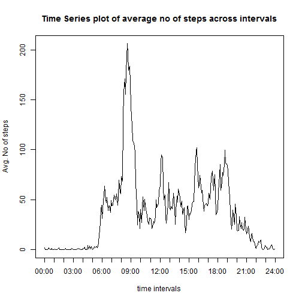
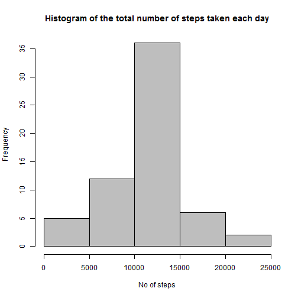

**Peer Assessment 1**

**Loading and preprocessing the data**

The data is assumed to be saved in the working directory. The data is imported as the dataframe called activitydata with string as factors = false. After the data has been imported, the date column is formatted as date variable.


```r
activitydata<-read.csv("./activity.csv",stringsAsFactors=FALSE)
activitydata$date<-as.Date(activitydata$date,"%Y-%m-%d") #convert date column to date class
```

**What is mean total number of steps taken per day?**
1. Make a histogram of the total number of steps taken each day


```r
gooddata<-activitydata[complete.cases(activitydata),]  #remove rows with NAs
total_by_day<-tapply(gooddata$steps,gooddata$date,sum)
hist(total_by_day, col="blue",main="Histogram of the total number of steps taken each day",xlab="No of steps",ylab="Frequency")
```

 

2. Calculate and report the mean and median total number of steps taken per day


```r
mean_by_day<-mean(total_by_day)
mean_by_day<-format(mean_by_day, digits=9, decimal.mark=".",big.mark=" ")
median_by_day<-median(total_by_day)
median_by_day<-format(median_by_day, digits=9, decimal.mark=".",big.mark=" ")
```

The mean total number of steps taken per day is 10 766.1887.

The median total number of steps taken per day is 10 765.

##What is the average daily activity pattern?

1.  time series plot of the 5-minute interval (x-axis) and the average number of steps taken, averaged across 
    all days (y-axis)

```r
avgbyinterval<-tapply(gooddata$steps,gooddata$interval,mean) #calculate average of steps for each interval across all days
startdate<-as.POSIXct("2012-10-01 00:00:00",tz="GMT")   #generate x axis labels for time series plot
enddate<-startdate + as.difftime(1,units="days")
timeint<-seq(from=startdate,by= "5 mins",to=enddate)
time_labels<-format(timeint,format="%H:%M")
time_labels[289]="24:00"
interval<-seq(from =1 ,to=289, by=12)
plot(avgbyinterval, type="l", xaxt="n", main="Time Series plot of average no of steps across intervals",xlab="time intervals",ylab="Avg. No of steps")
axis(1, at=interval, labels=time_labels[interval])
```

 

2. Which 5-minute interval, on average across all the days in the dataset, contains the maximum number of steps?


```r
max_no_of_steps<-max(avgbyinterval)
max_interval<-which.max(avgbyinterval)  #finding which interval has the maximum number of steps
max_time<-time_labels[max_interval]
```

The 5-minute interval with the maximum number of steps is the 08:35 interval with 206.1698113 steps

**Imputing missing values**

1. Calculate and report the total number of missing values in the dataset (i.e. the total number of rows with NAs)


```r
numNA<-sum(is.na(activitydata$steps))  #calculate total no of rows with NAs
```

The total number of missing values in the dataset is 2304

2. Devise a strategy for filling in all of the missing values in the dataset. The strategy does not need to be sophisticated. For example, you could use the mean/median for that day, or the mean for that 5-minute interval, etc.

To fill in the missing data, we filled in the missing values with the mean no of steps for that interval

3. Create a new dataset that is equal to the original dataset but with the missing data filled in.


```r
activitydata$int_index=(activitydata$interval-as.integer(activitydata$interval/100)*40)/5+1   #convert the interval representation into index
filledindata<-activitydata[,c(1,2,3)]
for (i in 1:nrow(filledindata)) {if(is.na(filledindata[i,1])){filledindata[i,1]<-avgbyinterval[(activitydata[i,4])]}} #fill in missing values using the mean for that interval
```

The new dataset created is assigned to the dataframe named filledindata

4. Make a histogram of the total number of steps taken each day and Calculate and report the mean and median total number of steps taken per day. Do these values differ from the estimates from the first part of the assignment? What is the impact of imputing missing data on the estimates of the total daily number of steps?

*Histrogram of filled in data*


```r
Total_filled_in<-tapply(filledindata$steps,filledindata$date,sum)
hist(Total_filled_in,col="grey",main="Histogram of the total number of steps taken each day",xlab="No of steps",ylab="Frequency")
```

 


```r
mean_filled_in<-mean(Total_filled_in)
mean_filled_in<-format(mean_filled_in, digits=9, decimal.mark=".",big.mark=" ")
median_filled_in<-median(Total_filled_in)
median_filled_in<-format(median_filled_in, digits=9, decimal.mark=".",big.mark=" ")
```


The mean total number of steps taken per day of filled in data is 10 766.1887.

The median total number of steps taken per day of filled in data is 10 766.1887.

The values of the mean total number of steps of the filled in data is the same as that of the first part of the assignment but the median is slightly different. The impact of imputing the missing data has miniaml impact on the estimates of the total daily number of steps. The only difference we can see if that there are more number of days which have total number of steps around the mean daily total number of steps. (as evidenced by the taller bar for the histogram around the central)

**Are there differences in activity patterns between weekdays and weekends?**

1. Create a new factor variable in the dataset with two levels - "weekday" and "weekend" indicating whether a given date is a weekday or weekend day.


```r
weekdays=c("Monday","Tuesday","Wednesday","Thursday","Friday")
weekend<-c("Saturday","Sunday")
filledindata$weekday_weekend=weekdays(filledindata$date)   #create a new variable to extract the day of the week based on the date

indicator<-sapply(filledindata$weekday_weekend,function(x) {if(x%in%weekdays){x<-"weekday"} else if(x%in%weekend){x<-"weekend"}})   #create a new factor with 2 levels "weekday" and "weekends"
filledindata$weekday_weekend<-indicator
```

2. Make a panel plot containing a time series plot (i.e. type = "l") of the 5-minute interval (x-axis) and the average number of steps taken, averaged across all weekday days or weekend days (y-axis). 


```r
library(lattice)
avgbyintervalbydaytype <- aggregate(filledindata$steps, by = list(filledindata$interval, filledindata$weekday_weekend),mean)
names(avgbyintervalbydaytype) <- c("interval", "wkday_or_wkend", "steps")
xyplot(steps ~ interval | wkday_or_wkend, avgbyintervalbydaytype, type = "l", layout = c(1, 2),
xlab = "time intervals", ylab = "Avg No of steps")
```

 
